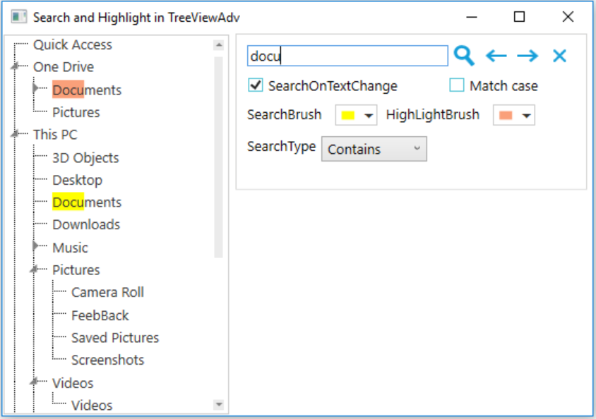

# How to search and highlight items in WPF TreeViewAdv?

In [WPF TreeViewAdv](https://help.syncfusion.com/wpf/classic/treeview/overview) to search and highlight the item, **Search** method has been implemented which is used to compare the search text with model items and highlighted the matched text in TextBlock inside the [TreeViewItemAdv](https://help.syncfusion.com/cr/wpf/Syncfusion.Windows.Tools.Controls.TreeViewItemAdv.html).

```csharp
if (mainitem != null && MatchSearchText(model.Header))
{
    // Function which is used to apply inline to the TextBlock
    ApplyInline(mainitem, false);
}
```

Options like Search, FindPrevious, Find Next, SearchType (Contains, EndsWith, StartsWith options) has been used to match search text using ApplyInline method and apply the SearchBrush for highlighting the search text.

```csharp
if (!string.IsNullOrEmpty(tempSearchText))
{
    if (this.SearchType == SearchType.StartsWith)
    {
        if (!(bool)CaseSensitiveSearchCheckBox.IsChecked)
            regex = new Regex("^(" + tempSearchText + ")", RegexOptions.IgnoreCase);
        else
            regex = new Regex("^(" + tempSearchText + ")", RegexOptions.None);
    }
    else if (this.SearchType == SearchType.EndsWith)
    {
        if (!(bool)CaseSensitiveSearchCheckBox.IsChecked)
            regex = new Regex("(" + tempSearchText + ")$", RegexOptions.IgnoreCase);
        else
            regex = new Regex("(" + tempSearchText + ")$", RegexOptions.None);
    }
    else
    {
        if (!(bool)CaseSensitiveSearchCheckBox.IsChecked)
            regex = new Regex("(" + tempSearchText + ")", RegexOptions.IgnoreCase);
        else
            regex = new Regex("(" + tempSearchText + ")", RegexOptions.None);
    }   
}
```
